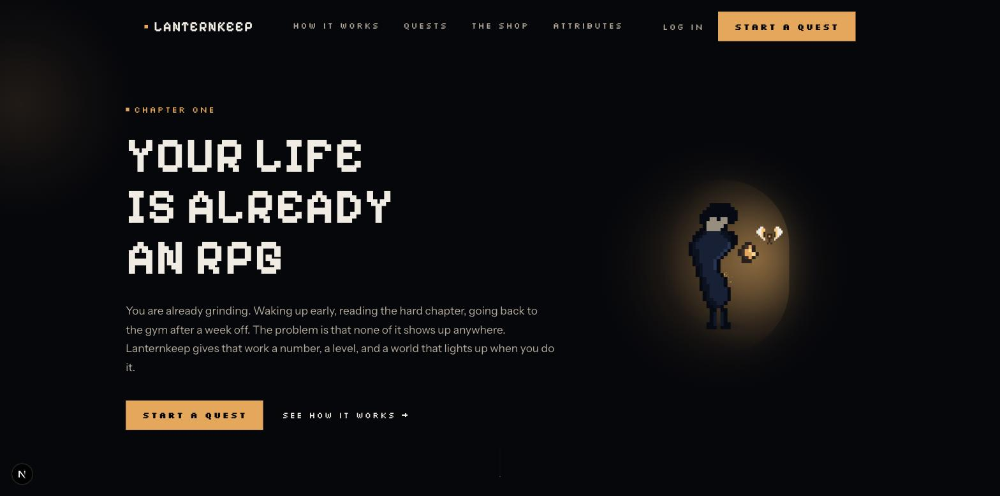
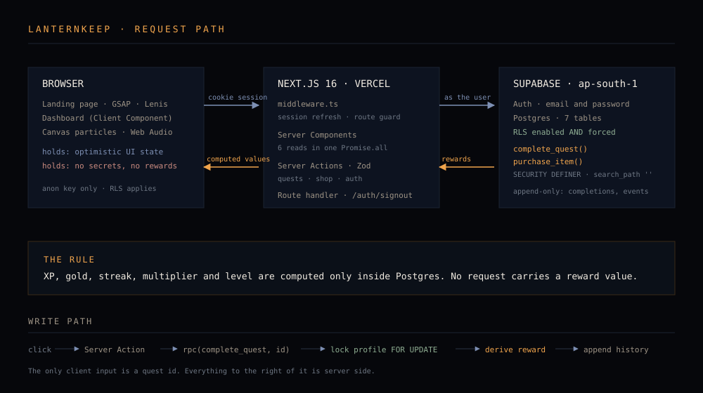
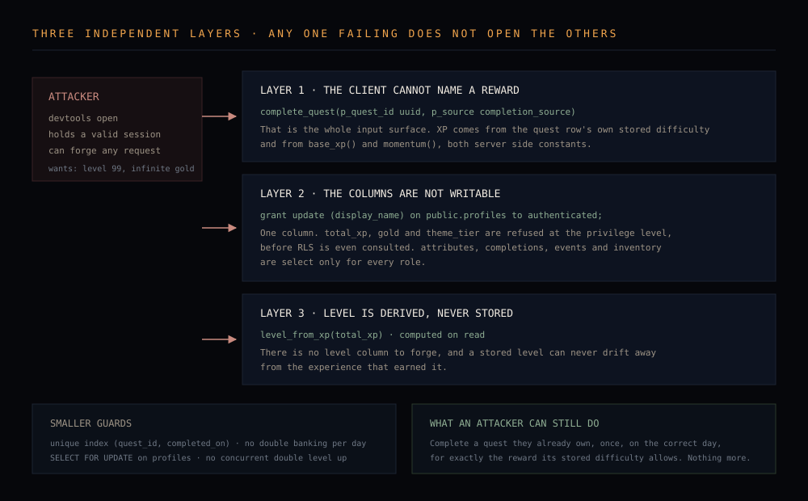
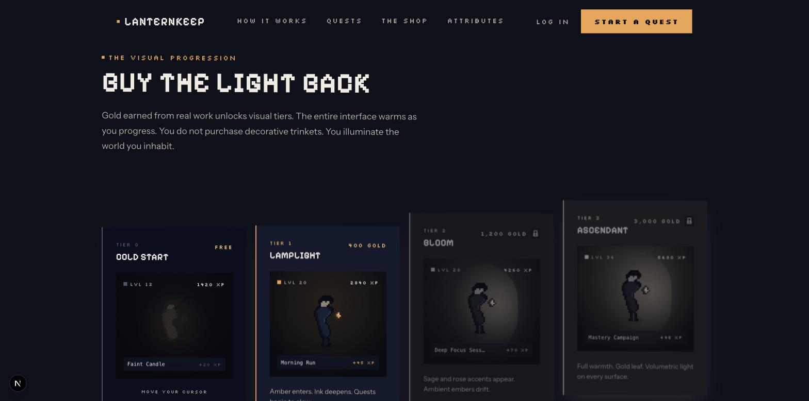
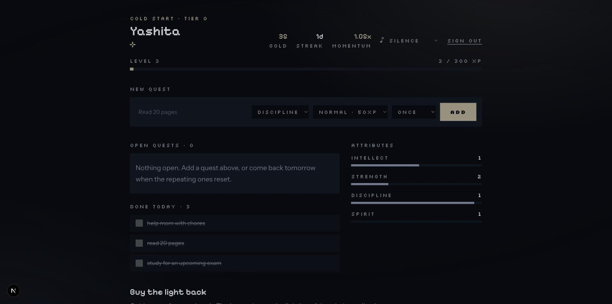
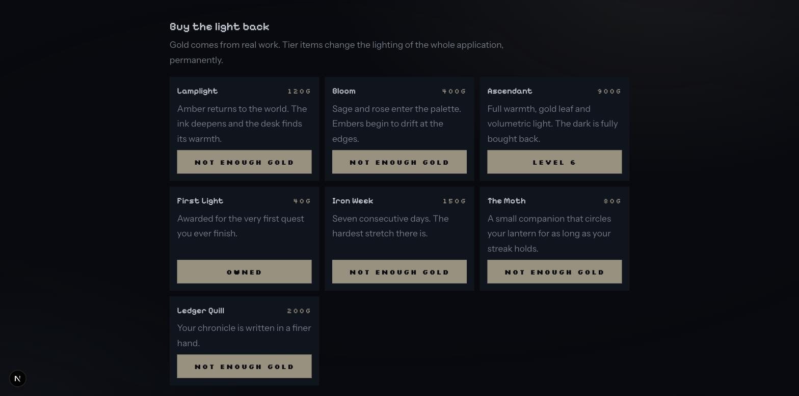

<div align="center">



<br/><br/>

# Lanternkeep

### A Life RPG where the world starts dark and you buy the light back

<br/>

**Most gamified to-do apps sell you a hat for your character. Lanternkeep sells you the lighting of the room you are standing in.**

A new account opens in near-monochrome with one weak lamp. Gold earned from real completed work
unlocks visual tiers that permanently warm and illuminate the entire interface. Progression is not a
number in the corner. It is the thing you are looking at.

<br/>

### **[ Open Lanternkeep live &rarr; ](https://lanternkeep-teal.vercel.app)**

<br/>


</div>

<br/>

**Contents** · [The problem](#the-problem) · [Buying the light back](#buying-the-light-back) · [Core systems](#core-systems) · [Architecture](#how-lanternkeep-is-built) · [Anti-cheat](#how-cheating-is-prevented) · [Progression maths](#progression-maths) · [Database](#database-schema) · [Running it locally](#running-it-locally) · [Deploying](#deploying) · [Accessibility](#accessibility) · [Inside Lanternkeep](#inside-lanternkeep) · [Verified state](#verified-state)

---

# The Problem

Habit trackers suffer from delayed gratification. Reading a hard chapter, going back to the gym, sitting
with a compiler until it yields. The real result of any of it arrives in months. A checkbox turning grey
is not a reward, and after two weeks the tracker becomes another abandoned app.

Games solved this a long time ago with immediate, legible feedback. The obvious move is to bolt XP onto a
to-do list, and roughly forty apps have already done exactly that. We researched eleven of them in
[`docs/research.md`](docs/research.md), with sources. The finding that shaped this build was not that
gamification fails, but **how** it fails:

- **Reward habituation.** Every competitor uses a static reward function. Forest's own long-term users
  report the tree mechanic losing its charm after a few months, and Forest has no answer for it.
- **Economy inflation.** If you set your own XP values and nothing verifies the work, your level is a
  number you chose. Habitica's design review names its spam mechanics outright.
- **Illegible consequences.** Habitica issue #15268 exists because users lose health and cannot tell why.

---

# Buying the Light Back

The shop does not sell cosmetics for an avatar. It sells the lighting of the application itself.

| Tier | Name | Unlocks at | What changes |
| --- | --- | --- | --- |
| 0 | Cold Start | free | Deep blue-black, one weak lamp, heavy vignette |
| 1 | Lamplight | 120 gold, level 1 | Amber returns, the ink deepens |
| 2 | Bloom | 400 gold, level 3 | Sage and rose enter, embers drift |
| 3 | Ascendant | 900 gold, level 6 | Full warmth and gold leaf |

Tier 0 is deliberately unlit, but unlit is not the same as unfinished. It is atmospheric and lonely, with a
lamp pool, a cool counter-light, a vignette and film grain, all of which intensify as tiers unlock. Buying
a tier fires a gold bloom across the screen and the palette transitions over 1.1 seconds, so it reads as an
event rather than a silent recolour.

The tiers were originally priced at 400 / 1200 / 3000. A handful of quests earns roughly 40 to 160 gold, so
nobody ever reached one and the signature mechanic was never actually seen. They are now priced so tier 1
lands after about three quests. **A mechanic nobody reaches is not a feature.**

---

# Core Systems

### Authentication
Email and password through Supabase Auth, with cookie sessions handled by `@supabase/ssr`. Route protection
and token refresh run in middleware. Sign out posts to a route handler rather than a Server Action, so it
works with JavaScript disabled.

### Quests
Full create, read, update and delete. Each quest carries an attribute, a difficulty and a cadence, either
once, daily or weekly. Editing is inline: Enter saves, Escape cancels.

### The progression engine
XP required to reach level *L* is `50 × (L−1) × L`, so every level costs 100 XP more than the one before it.
Level is derived from total XP on read and never stored, so the two cannot disagree.

### Attributes
Four stats: Intellect, Strength, Discipline, Spirit. Each quest feeds one of them, and each levels
independently on the same curve.

### Momentum, not health loss
Consecutive days build a multiplier from 1.00× to 1.50×. Missing a day costs velocity you can rebuild,
never a level you already earned. This is a deliberate reading of the retention evidence: Duolingo's single
largest retention win was Streak Freeze, a mechanic that *removes* the catastrophic failure state, and Finch
retains extremely well with no punishment at all. The reasoning and sources are in
[`docs/research.md`](docs/research.md).

### Economy and marks
Gold is a quarter of the XP awarded. Beyond the three tiers, badges and trinkets appear as pixel marks
beneath your name. **The Moth** circles your lantern only while your streak is alive, and settles when it
lapses. **The Ledger Quill** buys a finer hand: the chronicle then records the attribute, the multiplier and
the gold, not just the XP.

### Sound
Everything is synthesized with the Web Audio API. There is not one audio file in the repository. A decent
ambient loop is one to three megabytes, and any real track carries a licensing question on a submitted
project. Rain, fireplace and night wind are filtered noise. Adding, completing, levelling and purchasing
each have their own cue. All of it honours one mute switch, defaults to silence, and never auto-starts.

---

# How Lanternkeep Is Built

<p align="center">
  
</p>

A single Next.js application on the App Router. Server Components read from Postgres through
`@supabase/ssr`, Server Actions perform mutations, and Row Level Security scopes every query at the database
rather than in application code.

There is no separate API service, and the frontend and backend are not separate directories, because in the
App Router they are the same deployment. `app/play/page.tsx` runs on the server, `components/play/Dashboard.tsx`
runs in the browser, and `lib/actions/*` runs on the server while being called from the client. The layout
below marks which is which.

A few decisions worth naming:

**The client never names a reward.** `complete_quest(quest_id)` takes an id and nothing else. There is no
request shape that carries an XP number, so there is nothing to tamper with.

**Progression columns are unwritable, not merely protected.** The `authenticated` role holds `UPDATE` on
exactly one column of `profiles`, which is `display_name`. XP, gold and tier are refused at the privilege
level, before RLS is consulted.

**Reads rely on RLS, not on filters.** Queries do not append `.eq("user_id", …)`. If a policy were ever
wrong the query returns nothing rather than quietly returning somebody else's data.

**The dashboard fetches in parallel.** Six reads go out in one `Promise.all` rather than in series, because
six sequential round trips is the usual reason a server-rendered page feels slow.

<details>
<summary><b>Repository layout</b></summary>

```text
app/                          routes, server rendered unless marked
├── page.tsx                  landing page (client, GSAP)
├── layout.tsx                fonts, metadata, Open Graph
├── login/  signup/           auth screens
├── play/page.tsx             SERVER · the application, dynamic per request
├── auth/signout/route.ts     SERVER · route handler, clears the session
├── error.tsx                 route error boundary
├── global-error.tsx          root boundary, catches layout failures
├── not-found.tsx             404
├── robots.ts  sitemap.ts     SEO
└── opengraph-image.tsx       social card, generated at build

components/
├── landing/                  CLIENT · 9 sections, preloader to footer
├── play/                     CLIENT · dashboard, celebration, marks, tiers.css
├── sprites/                  CLIENT · 4 pixel characters, drawn as code
├── canvas/                   CLIENT · ember particle field
└── auth/                     CLIENT · auth form

lib/
├── supabase/                 server, browser and middleware clients
├── actions/                  SERVER · quests, shop, auth. Zod validated
├── game/                     SHARED · rules, types, queries
├── animations/               CLIENT · GSAP setup, Lenis, text reveals
└── audio/                    CLIENT · synthesis, ambience, event cues

supabase/migrations/          the entire database in one file
middleware.ts                 session refresh and route protection
docs/                         requirements, research, design notes, agent briefs
```

</details>

---

# How Cheating Is Prevented

The brief requires "a secure backend to prevent users from easily cheating their stats". Three independent
layers do that. Any one of them failing does not open the others.

<p align="center">
  
</p>

### 1. The client cannot name a reward

```sql
complete_quest(p_quest_id uuid, p_source completion_source)
```

That is the entire input. XP, gold, the momentum multiplier, the streak and the new level are all derived
inside the function from the quest row's own stored difficulty and from server-side constants in
`base_xp()` and `momentum()`. Forging the request from devtools lets you complete a quest you already own,
and nothing more.

### 2. The progression columns are not writable

```sql
revoke all on public.profiles from anon, authenticated;
grant select on public.profiles to authenticated;
grant update (display_name) on public.profiles to authenticated;
```

`total_xp`, `gold` and `theme_tier` cannot be written by a signed-in user at all. `attributes`,
`quest_completions`, `events` and `inventory` are select-only for everyone. Every write goes through a
`SECURITY DEFINER` function that re-checks `auth.uid()` in its own body, with `search_path` pinned empty.

### 3. Level is derived, never stored

`profiles` holds `total_xp` and nothing else about rank. Level comes from `level_from_xp()` at read time, so
there is no level field to forge and no way for a stored level to drift from the XP that earned it.

**Two smaller guards.** A partial unique index on `(quest_id, completed_on)` makes it impossible to bank the
same quest twice in one day. The profile row is locked `FOR UPDATE` at the top of each RPC, so two concurrent
completions cannot both read stale XP and double-apply a level up.

**One issue found and fixed.** Postgres grants `EXECUTE` on new functions to `PUBLIC` by default, so the
`anon` role could reach both RPCs over `/rest/v1/rpc/`. They already refused unauthenticated callers, but the
endpoint should not have been reachable at all. Revoked, and the Supabase security advisor is now clean apart
from the one intentional finding, that signed-in users can call the progression functions.

---

# Progression Maths

Cumulative XP to reach level *L* is `50 × (L−1) × L`.

| Level | Total XP | Cost of that level |
| --- | --- | --- |
| 1 | 0 | n/a |
| 2 | 100 | 100 |
| 3 | 300 | 200 |
| 4 | 600 | 300 |
| 5 | 1,000 | 400 |
| 10 | 4,500 | 900 |

Each level costs 100 XP more than the last, so the curve is quadratic and strictly non-linear.

Base XP by difficulty is 10 / 25 / 50 / 90 / 150, multiplied by momentum, which is
`1.00 + 0.05 × min(streak, 10)` and caps at 1.50×. Gold is a quarter of the XP awarded.

`lib/game/rules.ts` mirrors this maths in TypeScript so the interface can draw a progress bar without a
round trip. It is explicitly not the source of truth. Every value a user banks is returned by the database,
and where the two disagree the database wins.

---

# Database Schema

| Table | Purpose | What the client may do |
| --- | --- | --- |
| `profiles` | Character state: XP, gold, tier, streak | select · update `display_name` only |
| `attributes` | Four stat rows per user | select |
| `quests` | The user's tasks | full CRUD |
| `quest_completions` | Append-only history of every completion | select |
| `events` | Append-only log: sign-ups, level ups, purchases | select |
| `shop_items` | Global catalogue | select, readable by anyone |
| `inventory` | What the user owns | select |

Row Level Security is **enabled and forced** on every user-scoped table. Every policy scopes with
`(select auth.uid()) = user_id`, wrapped in a scalar subquery so Postgres evaluates it once per statement
instead of once per row. Every foreign key column carries an index.

`quest_completions` and `events` are never updated or deleted, which is what makes the historical log the
brief asks for genuinely historical.

---

# Running It Locally

### 1. Install

```bash
git clone https://github.com/lakshitasethia/tech_zephyr.git
cd tech_zephyr
npm install
```

### 2. Create the database

Create a project at [supabase.com/dashboard](https://supabase.com/dashboard), open **SQL Editor**, and run
the contents of:

```
supabase/migrations/0001_init.sql
```

One file creates every table, index, policy, function, grant and the seeded shop.

Then turn **off** email confirmation, or signup will create the account without signing the user in:
**Authentication → Sign In / Providers → Email → Confirm email**.

### 3. Environment

```bash
cp .env.example .env.local
```

| Variable | Where it comes from | Notes |
| --- | --- | --- |
| `NEXT_PUBLIC_SUPABASE_URL` | Project Settings → API → Project URL | e.g. `https://xxxx.supabase.co` |
| `NEXT_PUBLIC_SUPABASE_ANON_KEY` | Project Settings → API → `anon` `public` | Safe in the browser. RLS protects the data, not this key. |
| `NEXT_PUBLIC_SITE_URL` | your own URL | `http://localhost:3000` locally, the real domain in production |

There is no service role key anywhere in this project. The server never needs to bypass RLS.

### 4. Run

```bash
npm run dev
```

---

# Deploying

1. Push to GitHub and import the repository at [vercel.com/new](https://vercel.com/new).
2. Add the same three variables under **Settings → Environment Variables**, with `NEXT_PUBLIC_SITE_URL` set
   to the production domain rather than localhost.
3. In Supabase, under **Authentication → URL Configuration**, add the deployed domain to both **Site URL**
   and **Redirect URLs**. Skipping this is the classic failure: sign-in works locally and bounces in
   production.
4. Deploy, then sign up on the live URL before calling it done.

---

# Accessibility

- Semantic landmarks, one `h1` per page, labelled form controls throughout.
- Every control reachable by Tab, with a 2px amber focus ring, the only outline used anywhere in the design.
- The XP bar is a real `role="progressbar"` carrying live values.
- Toasts sit in an `aria-live="polite"` region; the level-up overlay is `aria-live="assertive"`.
- Decorative canvases and sprites are `aria-hidden`.
- Every animation, including the intro sequence, parallax, the tier transition and the level-up burst, is
  disabled under `prefers-reduced-motion`.
- No horizontal page scroll at any width down to 390px; pinned scroll effects are disabled below 900px.

---

# What Changes With Lanternkeep

| Ordinary to-do list | Lanternkeep |
| --- | --- |
| A checkbox turns grey | The world you are looking at gets brighter |
| Progress is a number you set yourself | Progress is computed server-side and cannot be forged |
| Rewards are cosmetics for an avatar | Rewards are the lighting of the application |
| Missing a day destroys a streak | Missing a day costs momentum you can rebuild |
| History is a list of ticked boxes | An append-only chronicle you can read back |
| Every task is worth the same | Difficulty and attribute decide the reward |
| Silence | Four synthesized cues and optional weather |

---

# Inside Lanternkeep

<table>
<tr>
<td width="50%"><br/><sub><b>The opening</b> &middot; a loader, then two typed lines, then the world</sub></td>
<td width="50%"><br/><sub><b>The visual progression</b> &middot; the four tiers, cold to fully lit</sub></td>
</tr>
<tr>
<td width="50%"><br/><sub><b>Tier 0, Cold Start</b> &middot; where every new account begins</sub></td>
<td width="50%"><br/><sub><b>The shop</b> &middot; gating by level and by gold, both enforced server side</sub></td>
</tr>
</table>

---

# Verified State

Claims here are drawn from the running implementation. Where something is incomplete it is said so rather
than omitted.

| Check | Result |
| --- | --- |
| Production build | `npm run build` passes; `tsc --noEmit` clean with no errors |
| Progression maths | Verified against the live database: `level_from_xp` returns 1, 1, 2, 2, 3, 10 at 0, 99, 100, 299, 300 and 4500 XP |
| Momentum | 1.00× at streak 0, 1.35× at 7, capped at 1.50× |
| Full loop | Signup, add quest, complete, 150 × 1.05 = 157 XP and 39 gold, level 2, buy Lamplight, tier 1, hard refresh with all state intact |
| Auth | Fresh signup, sign in, protected-route redirect and sign out all verified against the live database |
| Security advisor | Clean, apart from the intentional finding that signed-in users may call the progression RPCs |
| Responsiveness | No horizontal page scroll at 400px; every section carries a real gutter |
| Routes | `/`, `/login`, `/signup`, `/robots.txt`, `/sitemap.xml`, `/icon`, `/opengraph-image` all 200; `/play` correctly 307s when signed out; an unknown path returns a real 404 |
| Hydration | Clean console. The `<html>` element carries `suppressHydrationWarning` because a blocking script adds a class before React hydrates, which is deliberate |
| Copy | No em dashes or en dashes anywhere in `app/`, `components/` or `lib/` |
| Lint | `eslint` reports 5 errors and 1 warning, all from React Compiler's new `set-state-in-effect` and `refs` rules on landing page components. Every one is the standard read-a-browser-value-after-mount pattern, which is correct in context. They do not affect the build and are listed here rather than silenced. |

**Known gaps, stated plainly.** The sound cues are verified as wired and error free but have not been
listened to under automation, because a synthetic click is not a trusted user gesture and the AudioContext
stays suspended. Campaigns and the Warden appear on the landing page as a described mechanic and are not yet
implemented in the application. The shop ends at tier 3, so there is no endgame content beyond it. There is
no social or multiplayer layer.

---

# Built By

Built for the Tech Zephyr hackathon. The problem statement is preserved verbatim at
[`docs/requirements.txt`](docs/requirements.txt).

### AI assistance disclosure

Parts of this project were built with AI coding assistants, disclosed here because the rules require it.
The landing page was generated with Gemini in Antigravity and then repaired by Claude Opus 4.6, both from
written briefs kept in [`docs/`](docs/). The database, security model, server actions, application dashboard
and audio engine were built with Claude Opus 5. Competitive research is documented with sources in
[`docs/research.md`](docs/research.md). Commits carry co-author trailers where an assistant contributed.

---

<div align="center">

Lanternkeep is built on one idea: **the work you already do should show up somewhere.**

<br/>

### **[ Open Lanternkeep live → ](https://lanternkeep-teal.vercel.app)**

</div>
